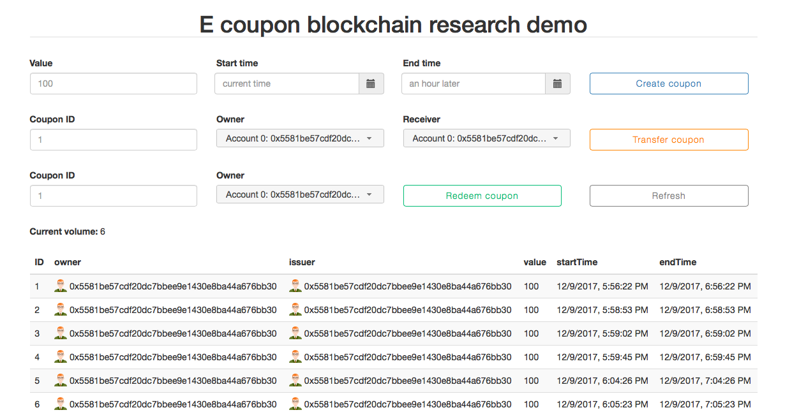

# E-coupon blockchain research project
HKUST university research. Supervised by prof. HUI Pan and Dimitris. 
This repository is created for better organization from the original repository [here](https://github.com/yhuag/Ethereum-HyperIntelligent-Contract-Research). 

## Demo 

## Usage
1. After cloning the repository, install the dependencies under this directory. 
`npm install`
2. Open testrpc in another terminal to create 10 distinct accounts for testing. 
`testrpc`
3. Compile and deploy our smart contracts:) `truffle migrate --reset`
4. Run our web app!  
`npm run dev`
5. Our application is running on [http://localhost:8080](http://localhost:8080)
 
 
 
Hope you like it:)
All suggestions are welcomed, thanks!!
